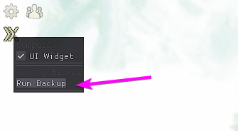

# Nexus Config Backup

A [Nexus addon](https://raidcore.gg/Nexus) to provide backup config files used by various GW2 addons

Currently, all files in `<GW2 Install>\addons` except for `.dll` files are compressed into a zip file
and stored under `%USER%\Documents\nexus-configs` folder with the time of each file timestamped in the format
`backup-YEAR-MONTH-DAY-HOUR-MINUTE.zip`

## Installation

> Install directly from the Nexus Addons Library or if it's not available, install locally below

1. Download the latest `.dll` from the Releases page
2. Drop the `.dll` into your `<Guild Wars 2>/addons/` folder
    1. Make sure the `.dll` is unblocked on your machine, by right-clicking the `.dll` file and clicking Properties
    2. If it's blocked at the bottom of the page if you see a "Unblock" checkbox, you must check this and save.

## Usage

Once installed, right-click on the Nexus icon in your Quick Access bar and select "Run Backup"

> Note: Currently running the backup will freeze your game for a second file your files are being compressed and saved,
> try not to run the backup during important gameplay

## TODO

* [ ] Add functionality to configure location of the backup
* [ ] Run backup code in a background thread to prevent the game from locking up during backup
* [ ] Add functionality to restore configs from directory
* [ ] Add functionality to configure number of backups to keep
* [ ] Add configurable cron schedule to automatically backup configs